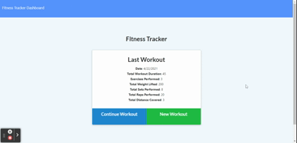

# Workout Tracker

## Description 

This application allows users to create and track daily workouts. Features of this application include: 
* Adding new exercises to a new workout plan.
* Adding exercises to the most recent workout plan.
* Viewing the combined weight of multiple exercises from the past seven workouts on the stats page.
* Viewing the total duration of each workout from the past seven workouts on the stats page.

## Technologies Used
* MongoDB
* Mongoose
* Node.js
* Express
* Deployed to Heroku with Mongo Atlas

## Deployed URL

[Click here for the deployed link!](https://workout-tracker-as.herokuapp.com/)

## Usage

This gif demonstrates some of the application's functionality:

## License

> This project was created under the [MIT License](https://opensource.org/licenses/MIT)

